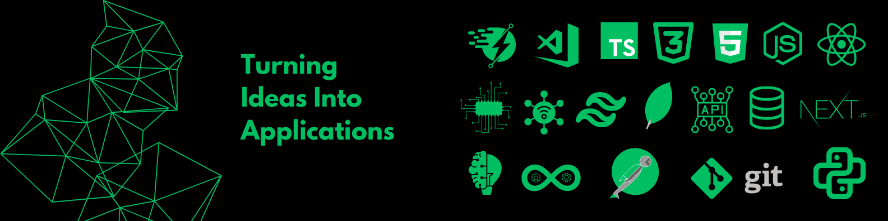

<!-- ======================= BANNER ======================= -->

  

<!-- ======================= GREETINGS ======================= -->

  

 

<!-- ======================= NAME + DESIGNATION ======================= -->
<h1 align="center">I am Asif Mahmud</h1>
<h3 align="center">Full Stack Programmer • MERN • Cloud • IoT</h3>

 

<!-- ======================= ABOUT + IMAGE ======================= -->
<table>
  <tr>
    <td width="60%" valign="top">

<h3>🙋‍♂️ About Me</h3>

<strong>I'm a passionate MERN Stack Developer who loves building scalable, high-performance web applications. I enjoy exploring new technologies, optimizing systems, and deep diving into backend architecture.</strong>

<ul>
  <li>🚀 Self Taught MERN Stack Developer</li>
  <li>🤝 Open to collaborations, research papers & journals</li>
</ul>

<h3>🔥 Current Activities</h3>
<ul>
  <li>🛠 Exploring DevOps, AWS & Go</li>
  <li>📚 Learning system design & backend architecture</li>
</ul>

<h3>📬 Connect with Me</h3>

  </td>

  <td width="40%" align="center">
      
    </td>
  </tr>
</table>

 

<!-- ======================= TECH STACK ======================= -->
<table>
  <tr>
    <td width="60%" valign="top">

<h3>💻 Tech Stack</h3> 

<h4>🧱 Development Stack</h4>

<h4>⚙️ DevOps Tools</h4>

<h4>🎨 Design</h4>

<h4>🐧 Linux SysAdmin</h4>

<h4>🚀 Deployment</h4>

  </td>

  <td width="40%" align="center">
      
  </td>
  </tr>
</table>

<!-- ======================= GITHUB STATS ======================= -->
<h3 align="center">📊 GitHub Stats</h3>

  
  

